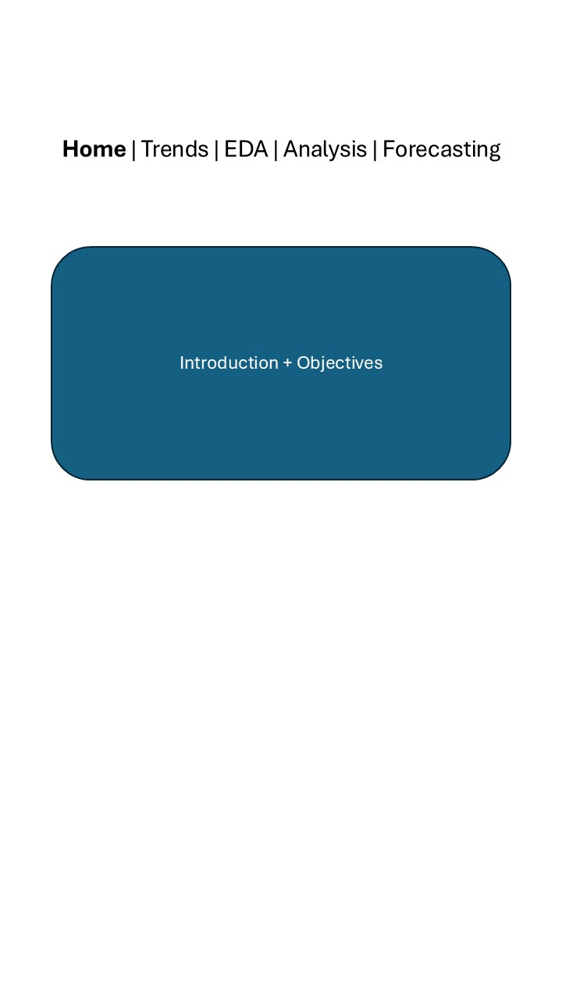
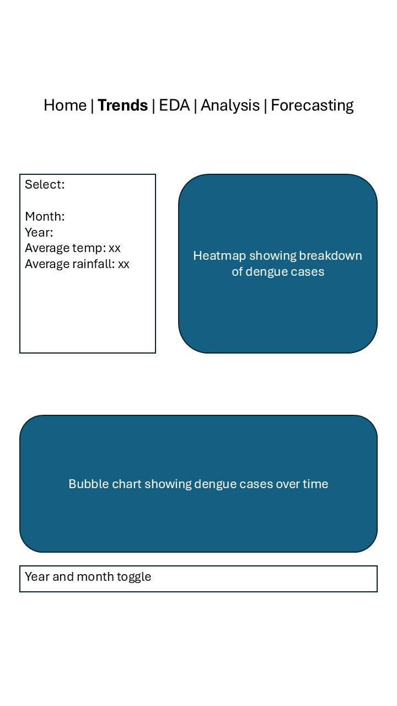
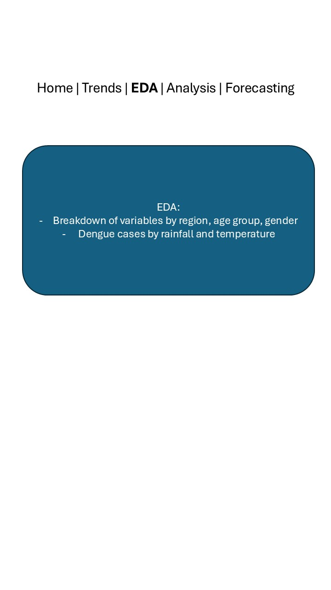
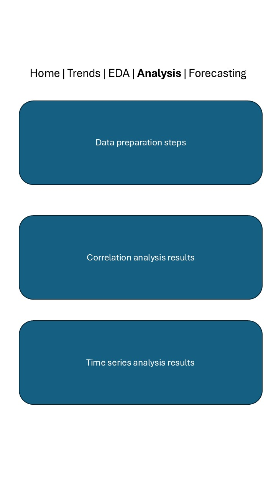
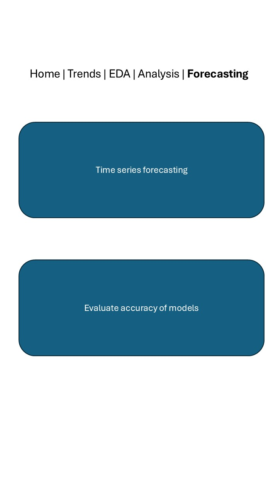

# Motivation

Dengue fever has been a pressing public health concern in tropical regions, including Taiwan and Singapore. Taiwan’s historical dengue cases data presents a good opportunity to analyse long-term trends and seasonal outbreaks.

Our project aims to:

-   Develop interactive visualisations to illustrate the temporal trends in dengue cases across the years, seasons and geographic locations in Taiwan

-   Perform time series forecasting to forecast future dengue cases based on past trends, and evaluate the accuracy of different forecasting models

-   Conduct correlation analysis of dengue cases with external factors

# Data Source

For this project, the [Taiwan Dengue Cases 1998-2024 dataset](https://www.kaggle.com/datasets/taweilo/taiwan-dengue-daily-confirmed-cases-1998-2024) will be used.

The dataset is retrieved from [Kaggle](https://www.kaggle.com).

# Problems / Issues the project will address

Dengue cases often fluctuate due to seasonal changes. Our project aims to identify key drivers of dengue outbreaks and raise public awareness.

Additionally, by leveraging time series forecasting models, we can determine the most suitable model for predicting dengue outbreaks. This enables stakeholders to take proactive rather than reactive measures in response to potential outbreaks.

# Relevant Related Work

On Kaggle, a basic EDA, correlation analysis and predictive modelling have been shared using this dataset:

-   Exploring Dengue Fever Cases in Taiwan: A Data-Driven Approach

We also identified 2 research papers related to the study of dengue cases that could potentially be useful for our project:

-   [Prediction of annual dengue incidence by hydro-climatic extremes for southern Taiwan](https://link.springer.com/article/10.1007/s00484-018-01659-w)

-   [Temporal patterns of dengue epidemics: The case of recent outbreaks in Kaohsiung](https://www.sciencedirect.com/science/article/pii/S1995764517301244)

# Proposed Approach 

1.  Load the relevant R packages

2.  Additional datasets, such as rainfall and temperature of Taiwan, might be required

3.  Data cleaning and creating additional relevant feature

4.  EDA

5.  Correlation analysis

6.  Time series analysis

7.  Time series forecasting

8.  Build Shiny dashboard for interactive visualization

The group will be working on tasks 1-4 together and will split up to work on tasks 5-8.

# Prototypes / Story Boards

\

