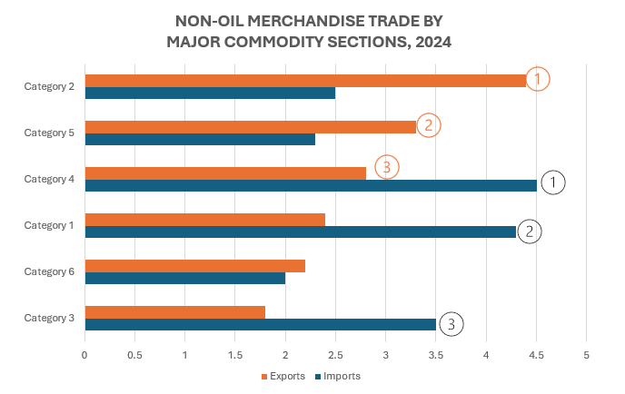
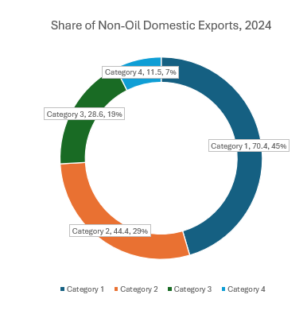
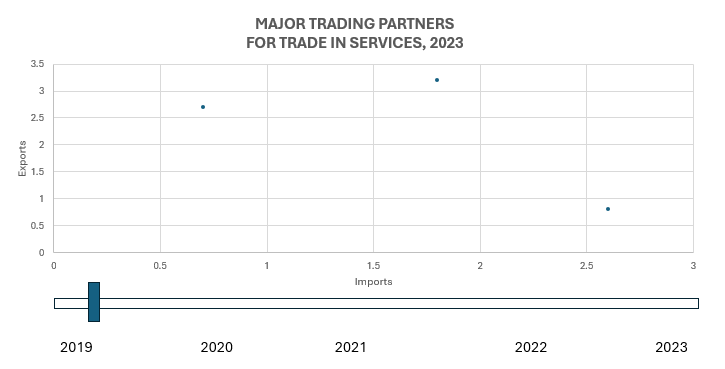

# 1. Introduction

Singapore has long been a global case study in open economies. Despite its small size, Singapore has demonstrated resilience to external shocks through strategic economic policies. Businesses worldwide leverage insights from the Department of Statistics Singapore to make informed decisions on imports and exports, leading to new investment opportunities.

Analysing Singapore's trade patterns provides insights into how the country maintains its competitive advantage in global commerce. Additionally, historical trade data helps identify growth trends and seasonal patterns over time.

# 2. Getting Started

## 2.1 Loading the relevant libraries

The following R packages will be used:

-   `readxl`: Reads Excel files in R

-   `tidyverse`: Used for data manipulation, visualisation and analysis

-   `tsibble`: Provides tools for handling and manipulating time series data

-   `feasts`: Provides functions for time series analysis, such as seasonal decomposition

-   `fable`: Framework for forecasting time series data in R

-   `seasonal`: Performs seasonal adjustments and time series decomposition for economic data

-   `zoo`: Provides functions for working with irregular time series and ordered observations in R

-   `plotly`: For plotting interactive statistical graphs

```{r}
pacman::p_load(readxl, tidyverse, tsibble, feasts, fable, seasonal,zoo, plotly)
```

## 2.2 Data Source

In this study, we will review the visualisations on the website that display statistics on Singapore's International Trade. [Click here](https://www.singstat.gov.sg/modules/infographics/singapore-international-trade) to access the page.

The “Merchandise Trade By Commodity Section/Division" and "Merchandise Trade by Region/Market" datasets will be used.

The dataset is retrieved from the [Department of Statistics Singapore](https://www.singstat.gov.sg/find-data/search-by-theme/trade-and-investment/merchandise-trade/latest-data).

# 3. Comments on Existing Data Visualisation

## 3.1 Non-oil Merchandise Trade by Major Commodity Sections, 2024


The use of commodity icons in the chart above is clear and easy to understand. The chart also maintains a consistent and clear colours scheme that effectively distinguishes between the exports and imports. The chart also displays the percentages of exports and imports as a proportion of the total exports and imports respectively.

However, there are a few areas for improvement. The chart is not sorted in any particular order, which makes it difficult to visually compare the data. In the Machinery & Transport Equipment category, the first half of the bar is striped, and is only unique to this category. It is unclear whether this has a specific meaning, which could confuse readers.

### 3.1.1 Potential Make-Over

Bar chart is a good illustration for this purpose. A potential improvement includes adding faint gridlines to enhance readability and make it easier to compare exports and imports across different commodity sections.

The bar chart will also be sorted by exports amount for better clarity. Clear indications of the top 3 exports and imports commodity sections will also be included.



## 3.2 Non-oil Domestic Exports by Major Commodity Sections, 2024


The visualisation above creatively incorporates icons and an animated bar chart design, making it visually appealing to readers. The use of icons enhanced readability, allowing readers to grasp the information at one glance. In addition to the icons, the chart includes legible labels displaying the import amounts, category names and percentages, ensuring clarity and ease of understanding.

However, the colour scheme used could be enhanced. Certain colours, such as dark pink, are difficult to distinguish from the red background. The bar chart is also not sorted by imports amounts, making it challenging for readers to immediately identify the top exports. While there may be a reason for this arrangement, it is not indicated anywhere in the visualisation. The top 3 commodity sections are highlighted in a separate chart below, but due to the sequence in the main bar chart, they are not easily identifiable at a glance.

Furthermore, the rectangular design at the end of the ship graphic blends into the main bar chart, which could cause visual confusion for some readers.

### 3.2.1 Potential Make-Over

A donut chart could be an effective illustration as it visually represents the percentage breakdown of each sector. We can also easily identify the top categories at a glance.



## 3.3 Major Trading Partners for Trade in Services, 2023


This chart is visually engaging, with appropriate use of flags and icons that make it easy to distinguish between countries, trade directions (exports vs imports). The comparison between 2019 and 2023 clearly shows the changes in trade performance between these 2 years. Additionally, the medal icons beside the top 3 countries effectively highlight top trading partners, providing an intuitive ranking.

However, the chart lacks context on why these specific years are chosen. This is likely to compare trade before and after Covid 19, with 2023 representing a post-recovery period and when trade has stabilised again. Additionally, the chart does not display the percentage change or growth indicators, making it harder to access trade trends at a glance.

### 3.3.1 Potential Make-Over

An animated bubble plot could be used to visualise changes in exports and imports by region over time. A toggle below the chart would allow readers to switch between years from 2019 to 2023, helping them to observe trends and shifts. The bubble size would represent the total export and imports volume of each region, while the x-axis would indicate import amounts and the y-axis would represent export amounts.



# 4. Make-Over of Existing Data Visualisation

In this section, the “Merchandise Trade By Commodity Section, (At Current Prices), Monthly” dataset will be used.

The dataset is retrieved from the [Department of Statistics Singapore](https://www.singstat.gov.sg/find-data/search-by-theme/trade-and-investment/merchandise-trade/latest-data).

We import the dataset using `read_excel()` of the *readxl* pacakage.

The first 10 rows and 79th row onwards will be skipped as these are just background information about the dataset.

```{r}
merchandise_trade <- read_excel("data/outputFile.xlsx",
                      sheet="T1", skip = 10, n_max = 68,
                      col_names = TRUE)
```

Lets view the first 28 rows of the dataset.

```{r}
head(merchandise_trade, 28)
```

From the preview above, here are the key observations:

-   Rows 6 to 14 are non-oil merchandise imports

-   Rows 19 to 27 are non-oil merchandise exports

-   Rows 33 to 41 are non-oil domestic exports

To help with our analysis, we will save these 3 sets of data separately, and taking only the 2024 datasets.

```{r}
non_oil_merchandise_imports <- merchandise_trade[19:27, c(1,3:14)]
non_oil_merchandise_exports <- merchandise_trade[33:41, c(1,3:14)]
non_oil_domestic_exports <- merchandise_trade[47:55, c(1,3:14)]
```

## 4.1 Non-oil Merchandise Trade by Major Commodity Sections, 2024

We start by creating a new column with the sum of 2024 non-oil exports and imports respectively.

```{r}
non_oil_merchandise_imports$`2024_sum_imports` <- rowSums(non_oil_merchandise_imports[, 2:13], na.rm = TRUE)
non_oil_merchandise_imports$`2024_sum_imports`
```

```{r}
non_oil_merchandise_exports$`2024_sum_exports` <- rowSums(non_oil_merchandise_exports[, 2:13], na.rm = TRUE)
non_oil_merchandise_exports$`2024_sum_exports`
```

Next, we join both tables, taking only the "2024_sum" columns.

```{r}
non_oil_merchandise <- full_join(non_oil_merchandise_exports, non_oil_merchandise_imports, by = "Data Series")

non_oil_merchandise <- non_oil_merchandise[, c("Data Series", "2024_sum_exports", "2024_sum_imports")]

non_oil_merchandise
```

Before plotting the bar chart, let's prepare the data further. We need to rearrange the data according the to Exports amount, then add a ranking to each of the Exports and Imports column so that the ranks can appear in the plot later on.

```{r}
non_oil_merchandise <- non_oil_merchandise %>%
  arrange(`2024_sum_exports`)

non_oil_merchandise_pivot <- non_oil_merchandise %>%
  pivot_longer(cols = c(`2024_sum_exports`, `2024_sum_imports`), names_to = "Trade Type", values_to = "2024 Sum")

non_oil_merchandise_pivot <- non_oil_merchandise_pivot %>%
  group_by(`Trade Type`) %>%
  mutate(Rank = rank(-`2024 Sum`, ties.method = "first"))

non_oil_merchandise_pivot$`Data Series` <- factor(non_oil_merchandise_pivot$`Data Series`, levels = non_oil_merchandise$`Data Series`)
```

We need to calculate the sum of exports and imports respectively for the labels in the chart.

```{r}
non_oil_merc_exp <- sum(non_oil_merchandise$`2024_sum_exports`)
non_oil_merc_imp <- sum(non_oil_merchandise$`2024_sum_imports`)

non_oil_merchandise_pivot <- non_oil_merchandise_pivot %>%
  mutate(Percentage = case_when(
    `Trade Type` == "2024_sum_exports" ~ `2024 Sum` / non_oil_merc_exp * 100,
    `Trade Type` == "2024_sum_imports" ~ `2024 Sum` / non_oil_merc_imp * 100
  ))
```

Next, we can plot the horizontal bar chart with the ranking labels.

```{r}
#| fig-height: 8
ggplot(non_oil_merchandise_pivot, aes(y = `Data Series`, x = `2024 Sum`, fill = `Trade Type`)) +
    geom_bar(stat = "identity", position = "dodge") + 
    labs(title = "NON-OIL MERCHANDISE TRADE BY MAJOR COMMODITY SECTIONS, 2024",
         x = "Trade Type") +
    theme_minimal() +
    scale_fill_manual(
    values = c("2024_sum_imports" = "#1f78b4", "2024_sum_exports" = "#FFA500"), 
    labels = c("2024_sum_exports" = "Export", "2024_sum_imports" = "Import") 
  ) +
    theme(
      plot.title = element_text(hjust = 0.5, face = "bold", size = 16),
      axis.text.x = element_text(angle = 45, hjust = 1),
      legend.position = "bottom" 
  ) +
    geom_text(data = filter(non_oil_merchandise_pivot, Rank %in% c(1, 2, 3)),
              aes(label = Rank, color = "Trade Type"),
              position = position_dodge(width = 0.7), 
              hjust = -0.2, vjust = 0.5, color = "black", size = 5) +
    geom_text(data = non_oil_merchandise_pivot,
            aes(label = scales::comma(`2024 Sum`)), 
            position = position_dodge(width = 0.7),  
            hjust = -0.3, vjust = 0.5, size = 3, color = "black") +
    geom_text(data = non_oil_merchandise_pivot,
            aes(label = paste(round(Percentage, 1), "%")),  
            position = position_dodge(width = 0.7), 
            hjust = 1.5, vjust = 0.5, size = 3, color = "black")
```

```{r}
non_oil_merchandise_pivot
```

## 4.2 Non-oil Domestic Exports by Major Commodity Sections, 2024

We start by creating a new column with the sum of 2024 non-oil domestic exports.

```{r}
non_oil_domestic_exports$`2024_sum` <- rowSums(non_oil_domestic_exports[, 2:13], na.rm = TRUE)
non_oil_domestic_exports$`2024_sum`
```

Next, we compute the sum of 2024 domestic exports, which will form the denominator of our percentage.

Then, we plot the donut chart with `ggplot()`.

```{r}
#| fig-height: 10
total_domestic_exports <- sum(non_oil_domestic_exports$`2024_sum`)

non_oil_domestic_exports <- non_oil_domestic_exports %>%
    mutate(
        percentage = (`2024_sum` / total_domestic_exports) * 100,
        label = paste(`Data Series`, "\n", `2024_sum`, " (", round(percentage, 1), "%)")
        ) 

ggplot(non_oil_domestic_exports, aes(x = 2, y = `2024_sum`, fill = `Data Series`)) +
    geom_bar(stat = "identity", width = 1, color = "white") +
    coord_polar("y", start = 0) + 
    theme_void() +  
    theme(legend.position = "right") +
    geom_text(aes(x = 2.5, label = label), position = position_stack(vjust = 0.5), size = 2) +
    ggtitle("NON-OIL DOMESTIC EXPORTS BY MAJOR COMMODITY SECTIONS, 2024") +
    theme(plot.title = element_text(hjust = 0.5, face = "bold", size = 20)) +
    xlim(0.5, 2.5)  
```

## 4.3 Major Trading Partners for Trade in Services, 2023

For this section, we will load the dataset from "Merchandise Trade By Region and Selected Market (Imports), Monthly" and "Merchandise Trade By Region and Selected Market (Exports), Monthly".

The dataset is also retrieved from the [Department of Statistics Singapore](https://www.singstat.gov.sg/find-data/search-by-theme/trade-and-investment/merchandise-trade/latest-data) and we import the dataset using `read_excel()` of the *readxl* pacakage.

The first 10 rows and 160th row onwards will be skipped as these are just background information about the dataset.

```{r}
imports_services <- read_excel("data/outputFile_region_market.xlsx",
                      sheet="T1", skip = 10, n_max = 160,
                      col_names = TRUE)

exports_services <- read_excel("data/outputFile_region_market.xlsx",
                      sheet="T2", skip = 10, n_max = 160,
                      col_names = TRUE)
```

We are only interested in the data from 2019 to 2023, hence we filter the data for each of the `imports_services` and `exports_services` dataset.

```{r}
imports_services_trades <- imports_services[, c(1,15:75)]

imports_services_trades <- imports_services_trades %>%
  mutate(
    `2023_sum_imports` = rowSums(select(., 2:13), na.rm = TRUE),
    `2022_sum_imports` = rowSums(select(., 14:25), na.rm = TRUE),
    `2021_sum_imports` = rowSums(select(., 26:37), na.rm = TRUE),
    `2020_sum_imports` = rowSums(select(., 38:49), na.rm = TRUE),
    `2019_sum_imports` = rowSums(select(., 50:61), na.rm = TRUE)
    ) %>% 
    select(`Data Series`, `2023_sum_imports`, `2022_sum_imports`, `2021_sum_imports`, `2020_sum_imports`, `2019_sum_imports`)

exports_services_trades <- exports_services[, c(1,15:75)]

exports_services_trades <- exports_services_trades %>%
  mutate(
    `2023_sum_exports` = rowSums(select(., 2:13), na.rm = TRUE),
    `2022_sum_exports` = rowSums(select(., 14:25), na.rm = TRUE),
    `2021_sum_exports` = rowSums(select(., 26:37), na.rm = TRUE),
    `2020_sum_exports` = rowSums(select(., 38:49), na.rm = TRUE),
    `2019_sum_exports` = rowSums(select(., 50:61), na.rm = TRUE)
    ) %>% 
    select(`Data Series`, `2023_sum_exports`, `2022_sum_exports`, `2021_sum_exports`, `2020_sum_exports`, `2019_sum_exports`)
```

We group the dataset by EU-27, ASEAN and other countries listed on the original chart.

```{r}
EU27 <- c("Austria", "Belgium", "Bulgaria", "Croatia", "Cyprus", "Czech Rep", "Denmark", "Estonia", "Finland", "France", "Germany", "Greece", "Hungary", "Ireland", "Italy", "Latvia", "Lithuania", "Luxembourg", "Malta", "Netherlands", "Poland", "Portugal", "Romania", "Slovakia", "Slovenia", "Spain", "Sweden")

ASEAN <- c(
  "Brunei", "Cambodia", "Indonesia", "Laos", "Malaysia", "Myanmar", 
  "Philippines", "Singapore", "Thailand", "Viet Nam"
)

other_countries <- c("United States", "China", "Japan", "Hong Kong", "Australia", "United Kingdom", "Switzerland", "India")
```

For each of the import and export services dataset, we group the data by the required regions, then pivot to a long form and retrieve the corresponding years.

```{r}
imports_services_grouped <- imports_services_trades %>%
    group_by(Partner = case_when(
    `Data Series` %in% EU27 ~ "EU-27",
    `Data Series` %in% ASEAN ~ "ASEAN",
    `Data Series` %in% other_countries ~ `Data Series`,
    TRUE ~ as.character(NA))) %>%
    filter(!is.na(Partner)) %>%
    summarise(`2023_sum_imports` = sum(`2023_sum_imports`, na.rm = TRUE),
              `2022_sum_imports` = sum(`2022_sum_imports`, na.rm = TRUE),
              `2021_sum_imports` = sum(`2021_sum_imports`, na.rm = TRUE),
              `2020_sum_imports` = sum(`2020_sum_imports`, na.rm = TRUE),
              `2019_sum_imports` = sum(`2019_sum_imports`, na.rm = TRUE))

imports_services_grouped
```

```{r}
imports_services_pivot <- imports_services_grouped %>%
    pivot_longer(cols = c(`2023_sum_imports`, `2022_sum_imports`, `2021_sum_imports`, `2020_sum_imports`, `2019_sum_imports`), 
                 names_to = "Year", values_to = "Imports")

imports_services_pivot <- imports_services_pivot %>%
    mutate(Year = str_split_fixed(Year, "_", 2)[, 1])

imports_services_pivot
```

```{r}
exports_services_grouped <- exports_services_trades %>%
    group_by(Partner = case_when(
    `Data Series` %in% EU27 ~ "EU-27",
    `Data Series` %in% ASEAN ~ "ASEAN",
    `Data Series` %in% other_countries ~ `Data Series`,
    TRUE ~ as.character(NA))) %>%
    filter(!is.na(Partner)) %>%
    summarise(`2023_sum_exports` = sum(`2023_sum_exports`, na.rm = TRUE),
              `2022_sum_exports` = sum(`2022_sum_exports`, na.rm = TRUE),
              `2021_sum_exports` = sum(`2021_sum_exports`, na.rm = TRUE),
              `2020_sum_exports` = sum(`2020_sum_exports`, na.rm = TRUE),
              `2019_sum_exports` = sum(`2019_sum_exports`, na.rm = TRUE))

exports_services_grouped
```

```{r}
exports_services_pivot <- exports_services_grouped %>%
    pivot_longer(cols = c(`2023_sum_exports`, `2022_sum_exports`, `2021_sum_exports`, `2020_sum_exports`, `2019_sum_exports`), 
                 names_to = "Year", values_to = "Exports")

exports_services_pivot <- exports_services_pivot %>%
    mutate(Year = str_split_fixed(Year, "_", 2)[, 1])

exports_services_pivot
```

Next, we combine both datasets into a single dataset using `full_join()`. We also create a column for "Total Trade", by taking the sum of exports and imports each year for each region.

```{r}
major_trading_partners <- full_join(exports_services_pivot,
                                    imports_services_pivot, 
                                    by = c("Partner", "Year"))
```

```{r}
major_trading_partners <- major_trading_partners %>%
    mutate(`Total Trade` = `Exports` + `Imports`)
major_trading_partners
```

Finally, we plot the interactive bubble plot and allow viewers to toggle between the years and view the changes in trade volumes.

```{r}
major_trading_partners <- major_trading_partners %>%
    plot_ly(x = ~`Imports`, 
            y = ~`Exports`, 
            size = ~`Total Trade`, 
            color = ~Partner,
            sizes = c(2, 100),
            frame = ~Year, 
            text = ~Partner, 
            hoverinfo = "text",
            type = 'scatter',
            mode = 'markers'
            ) %>%
    layout(showlegend = FALSE)
major_trading_partners
```

# 5. Time Series Analysis

The third and final task involves analysing data with time-series analysis.

## 5.1 Data Source and Importing Data

In this section, the "Merchandise Trade By Region and Selected Market (Imports), Monthly" dataset will be used.

The dataset is retrieved from the [Department of Statistics Singapore](https://www.singstat.gov.sg/find-data/search-by-theme/trade-and-investment/merchandise-trade/latest-data).

We import the dataset using `read_excel()` of the *readxl* pacakage.

```{r}
imports <- read_excel("data/outputFile_region_market.xlsx",
                      sheet="T1", skip = 10, n_max = 160,
                      col_names = TRUE) %>%
    mutate(Continent = case_when(
        row_number() >= 2  & row_number() <= 32  ~ "America",
        row_number() >= 33 & row_number() <= 74  ~ "Asia",
        row_number() >= 75 & row_number() <= 110 ~ "Europe",
        row_number() >= 111 & row_number() <= 125 ~ "Oceania",
        row_number() >= 126 & row_number() <= 160 ~ "Africa"
        ))
```

## 5.2 Data Pre-Processing

First, we view the first 32 rows of the dataset.

```{r}
head(imports, 32)
```

From the preview above, here are the key observations:

-   Row 1 shows the total imports of all markets

-   Row 2 shows the the total imports of America

-   Rows 3 to 31 are the breakdown of imports of countries in America

-   Row 32 show the imports of other markets of America

-   This patterns repeats for all other continents, i.e. Asia, Europe, Oceania, Africa

To help with our analysis, firstly we split the data by Countries (`imports_countries`) and Continents (`imports_continents`).

```{r}
imports_countries <- imports[c(-1, -2, -33, -75, -111, -126), ]
imports_countries
```

```{r}
imports_continents <- imports[c(2, 33, 75, 111, 126), ]
imports_continents
```

We clean up the dataset by correcting the data format, and setting the `Year-Month` column as a column instead of row names.

```{r}
t_imports_countries <- as.data.frame(t(imports_countries), stringsAsFactors = FALSE)

colnames(t_imports_countries) <- as.character(unlist(t_imports_countries[1, ]))


t_imports_countries$`Year-Month` <- rownames(t_imports_countries)
rownames(t_imports_countries) <- NULL

t_imports_countries <- t_imports_countries[-1, ]
```

```{r}
colnames(t_imports_countries)
```

Next, we move the "Year-Month" column to the first column for easy reference.

```{r}
t_imports_countries <- t_imports_countries[, c(ncol(t_imports_countries), 1:(ncol(t_imports_countries) - 1))]

t_imports_countries$`Year-Month` <- as.yearmon(t_imports_countries$`Year-Month`, format = "%Y %b") %>%
  yearmonth()
```

We will preserve the continent information, and this has to be done before we convert the dataset to a tsibble object.

```{r}
continent_info <- t_imports_countries[nrow(t_imports_countries), -1]  

continent_info <- setNames(as.character(unlist(continent_info)), colnames(t_imports_countries)[-1]) 

t_imports_countries <- t_imports_countries %>%
  slice(-n())
```

Convert to a tsibble object to preserve essential data column for time series analysis.

```{r}
tibble_imports_countries <- t_imports_countries %>%
    as_tsibble(index = `Year-Month`)

tibble_imports_countries
```

```{r}
ncol(tibble_imports_countries)
```

Next, we pivot the table and ensure the import values of every country is numeric, instead of character type.

```{r}
imports_countries_pivot <- tibble_imports_countries %>%
    pivot_longer(cols = c(2:155),
                 names_to = "Country",
                 values_to = "Imports")

imports_countries_pivot$Imports <- as.numeric(imports_countries_pivot$Imports)

imports_countries_pivot
```

We patch the Continent information back to the dataset.

```{r}
imports_countries_pivot <- imports_countries_pivot %>%
  mutate(Continent = continent_info[Country])

imports_countries_pivot
```

## 5.3 Visualising Time-Series Data

::: panel-tabset
#### America

```{r}
#| fig-height: 10
#| echo: FALSE
ggplot(data = imports_countries_pivot %>% filter(Continent == "America"), 
       aes(x = `Year-Month`, 
           y = Imports,
           color = Country))+
  geom_line(size = 0.5) +
  theme(legend.position = "bottom", 
        legend.box.spacing = unit(0.5, "cm"))
```

#### Asia

```{r}
#| fig-height: 10
#| echo: FALSE
ggplot(data = imports_countries_pivot %>% filter(Continent == "Asia"), 
       aes(x = `Year-Month`, 
           y = Imports,
           color = Country))+
  geom_line(size = 0.5) +
  theme(legend.position = "bottom", 
        legend.box.spacing = unit(0.5, "cm"))
```

#### Europe

```{r}
#| fig-height: 10
#| echo: FALSE
ggplot(data = imports_countries_pivot %>% filter(Continent == "Europe"), 
       aes(x = `Year-Month`, 
           y = Imports,
           color = Country))+
  geom_line(size = 0.5) +
  theme(legend.position = "bottom", 
        legend.box.spacing = unit(0.5, "cm"))
```

#### Oceania

```{r}
#| fig-height: 10
#| echo: FALSE
ggplot(data = imports_countries_pivot %>% filter(Continent == "Oceania"),
       aes(x = `Year-Month`, 
           y = Imports,
           color = Country))+
    geom_line(size = 0.5) +
    theme(legend.position = "bottom", 
          legend.box.spacing = unit(0.5, "cm")) 
```

#### Africa

```{r}
#| fig-height: 10
#| echo: FALSE
ggplot(data = imports_countries_pivot %>% filter(Continent == "Africa"), 
       aes(x = `Year-Month`, 
           y = Imports,
           color = Country))+
  geom_line(size = 0.5) +
  theme(legend.position = "bottom", 
        legend.box.spacing = unit(0.5, "cm"))
```

#### The Code

```{r}
#| eval: FALSE

# Change the value for "Continent" accordingly: America, Asia, Europe, Oceania, Africa
ggplot(data = imports_countries_pivot %>% filter(Continent == "America"), 
       aes(x = `Year-Month`, 
           y = Imports,
           color = Country))+
  geom_line(size = 0.5) +
  theme(legend.position = "bottom", 
        legend.box.spacing = unit(0.5, "cm"))
```
:::

\

::: panel-tabset
#### America

```{r}
#| fig-height: 10
#| echo: FALSE
ggplot(data = imports_countries_pivot %>% filter(Continent == "America"), 
       aes(x = `Year-Month`, 
           y = Imports)) +
    geom_line(size = 0.5) +
    facet_wrap(~ Country,
               ncol = 3,
               scales = "free_y") +
    theme_bw() +
    theme(axis.text.x = element_text(angle = 45, hjust = 1))
```

#### Asia

```{r}
#| fig-height: 10
#| echo: FALSE
ggplot(data = imports_countries_pivot %>% filter(Continent == "Asia"), 
       aes(x = `Year-Month`, 
           y = Imports))+
    geom_line(size = 0.5) +
    facet_wrap(~ Country,
               ncol = 3,
               scales = "free_y") +
    theme_bw() + 
    theme(axis.text.x = element_text(angle = 45, hjust = 1))
```

#### Europe

```{r}
#| fig-height: 10
#| echo: FALSE
ggplot(data = imports_countries_pivot %>% filter(Continent == "Europe"), 
       aes(x = `Year-Month`, 
           y = Imports))+
    geom_line(size = 0.5) +
    facet_wrap(~ Country,
               ncol = 3,
               scales = "free_y") +
    theme_bw() + 
    theme(axis.text.x = element_text(angle = 45, hjust = 1))
```

#### Oceania

```{r}
#| fig-height: 10
#| echo: FALSE
ggplot(data = imports_countries_pivot %>% filter(Continent == "Oceania"), 
       aes(x = `Year-Month`, 
           y = Imports))+
    geom_line(size = 0.5) +
    facet_wrap(~ Country,
               ncol = 3,
               scales = "free_y") +
    theme_bw() + 
    theme(axis.text.x = element_text(angle = 45, hjust = 1))
```

#### Africa

```{r}
#| fig-height: 10
#| echo: FALSE
ggplot(data = imports_countries_pivot %>% filter(Continent == "Africa"), 
       aes(x = `Year-Month`, 
           y = Imports))+
    geom_line(size = 0.5) +
    facet_wrap(~ Country,
               ncol = 3,
               scales = "free_y") +
    theme_bw() +
    theme(axis.text.x = element_text(angle = 45, hjust = 1))
```

#### The Code

```{r}
#| eval: FALSE

# Change the value for "Continent" accordingly: America, Asia, Europe, Oceania, Africa
ggplot(data = imports_countries_pivot %>% filter(Continent == "Asia"), 
       aes(x = `Year-Month`, 
           y = Imports))+
    geom_line(size = 0.5) +
    facet_wrap(~ Country,
               ncol = 3,
               scales = "free_y") +
    theme_bw() + 
    theme(axis.text.x = element_text(angle = 45, hjust = 1))
```
:::

## 5.4 Visualise Seasonality with Cycle Plot

Let's visualise the imports trend of a few countries with Cycle Plot. From Asia, China, Vietnam and Kuwait will be analysed. From Europe, Italy, Czech Republic and Slovania will be analysed. These countries are selected as there are visible trends in their graphs.

### 5.4.1 Asia

```{r}
imports_countries_pivot %>%
    filter(Country == "China" |
               Country == "Viet Nam" |
               Country == "Kuwait") %>% 
    autoplot(Imports) + 
    facet_grid(Country ~ ., scales = "free_y")
```

```{r}
imports_countries_pivot %>%
    filter(Country == "China" |
               Country == "Viet Nam" |
               Country == "Kuwait") %>% 
    gg_subseries(Imports)
```

From the cycle plot above, China and Vietnam have visible increasing trend whereas Kuwait has a general decreasing trend in imports.

Kuwait show more erratic fluctuations, indicating potential irregular trade patterns with Singapore.

### 5.4.2 Europe

```{r}
imports_countries_pivot %>%
    filter(Country == "Italy" | 
               Country == "Czech Rep" |
               Country == "Slovenia") %>% 
    autoplot(Imports) + 
    facet_grid(Country ~ ., scales = "free_y")
```

```{r}
imports_countries_pivot %>%
    filter(Country == "Italy" | 
               Country == "Czech Rep" |
               Country == "Slovenia") %>% 
    gg_subseries(Imports)
```

From the cycle plot above, we observe a general upward trend across all months for all 3 countries.

For Czech Rep, there is a huge increase in September 2025, but the imports for other months are steadily increasing.

Italy has higher import values than 2 other countries. Slovenia has larger fluctuations compared to other countries.

## 5.5 Time Series Decomposition

```{r}
imports_countries_pivot %>%
    filter(`Country` == "China"|
               `Country` == "Viet Nam" |
               `Country` == "Kuwait" |
               `Country` == "Italy" |
               `Country` == "Czech Rep" |
               `Country` == "Slovenia") %>%
    ACF(Imports) %>%
    autoplot()
```

An ACF (autocorrelation function) plot visually represents the correlation of a time series, helping us identify the seasonality and trend patterns.

From the ACF plot, there are signs of auto-correlation of the countries selected as the lags are statistically significant at 95% confidence interval.

The seasonal patterns seem to repeat every 12 months. Italy, Slovenia and Vietnam dies down faster in the second cycle.

```{r}
imports_countries_pivot %>%
    filter(`Country` == "China"|
               `Country` == "Viet Nam" |
               `Country` == "Kuwait" |
               `Country` == "Italy" |
               `Country` == "Czech Rep" |
               `Country` == "Slovenia") %>%
    PACF(Imports) %>%
    autoplot()
```

The PACF (partial auto-correlation function) plot shows the direct correlation between the time series and its lagged values.

From the PACF plot, all countries are significant at lag 2, where Vietnam, Kuwait, Slovenia are more significant than other countries.

China and Italy are also significant at lag 12, indicating a seasonality with 12-period cycle. Interestingly, at lag 13, the PACF of China imports is significant but towards the opposite direction. This might indicate a lagging seasonal effect where the change takes an extra period to reflect.

## 5.6 Time Series Forecasting

### 5.6.1 China - Data Sampling

We split the original dataset into holdout and training datasets.

::: panel-tabset
#### Holdout

```{r}
china_holdout <- imports_countries_pivot %>%
  filter(Country == "China") %>% 
  mutate(Type = if_else(
    `Year-Month` >= yearmonth("2024 Jan"), 
    "Hold-out", "Training"))
```

#### Training

```{r}
china_train <- china_holdout %>%
  filter(`Year-Month` < yearmonth("2024 Jan"))
```
:::

### 5.6.2 China - EDA on Time Series Data

```{r}
china_train %>%
  model(stl = STL(Imports)) %>%
  components() %>%
  autoplot()
```

### 5.6.3 China - Fitting Forecasting Models

The code chunk below fits multiple ETS models, and we visualise the results using `report()`.

```{r}
fit_ETS_cn <- china_train %>%
  model(`SES` = ETS(Imports ~ error("A") + 
                      trend("N") + 
                      season("N")),
        `Holt`= ETS(Imports ~ error("A") +
                      trend("A") +
                      season("N")),
        `damped Holt` = 
          ETS(Imports ~ error("A") +
                trend("Ad") + 
                season("N")),
        `WH_A` = ETS(
          Imports ~ error("A") + 
            trend("A") + 
            season("A")),
        `WH_M` = ETS(Imports ~ error("M") 
                         + trend("A") 
                         + season("M"))
  )
```

```{r}
fit_ETS_cn %>% 
  report()
```

### 5.6.4 China - Forecasting Future Values

We forecast the values for last 12 months using `forecast()`.

```{r}
fit_ETS_cn %>%
  forecast(h = "12 months") %>%
  autoplot(china_holdout, 
           level = NULL)
```

From the graph above, it seems like the Hold-Winters multiplicative (WH_M) method predicts the China imports better than other models. Moreover, the AIC value for this model is the lowest among all the fitted models, indicating that this model is more suited in forecasting China imports.

### 5.6.5 Italy - Data Sampling

We split the original dataset into holdout and training datasets.

::: panel-tabset
#### Holdout

```{r}
italy_holdout <- imports_countries_pivot %>%
  filter(Country == "Italy") %>% 
  mutate(Type = if_else(
    `Year-Month` >= yearmonth("2024 Jan"), 
    "Hold-out", "Training"))
```

#### Training

```{r}
italy_train <- italy_holdout %>%
  filter(`Year-Month` < yearmonth("2024 Jan"))
```
:::

### 5.6.6 Italy - EDA on Time Series Data

```{r}
italy_train %>%
  model(stl = STL(Imports)) %>%
  components() %>%
  autoplot()
```

### 5.6.7 Italy - Fitting Forecasting Models

The code chunk below fits ETS automatically, and we visualise the results using `report()`.

```{r}
fit_autoETS <- italy_train %>%
  model(ETS(Imports))
fit_autoETS %>% report()
```

### 5.6.8 Italy - Forecasting Future Values

We forecast the values for last 12 months using `forecast()`.

```{r}
fit_autoETS %>%
  forecast(h = "12 months") %>%
  autoplot(italy_train)
```

```{r}
fc_autoETS <- fit_autoETS %>%
  forecast(h = "12 months")

china_holdout %>%
  ggplot(aes(x= `Year-Month`, 
             y= Imports)) +
  autolayer(fc_autoETS, 
            alpha = 0.6) +
  geom_line(aes(
    color = Type), 
    alpha = 0.8) + 
  geom_line(aes(
    y = .mean, 
    colour = "Forecast"), 
    data = fc_autoETS) +
  geom_line(aes(
    y = .fitted, 
    colour = "Fitted"), 
    data = augment(fit_autoETS))
```
